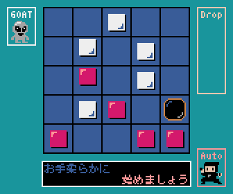

# オストル

[オストル](https://gamemarket.jp/game/76310)を参考にしました。

## 操作方法

* マウスを使って操作します。
* 「CPU 対 あなた」を選択するとコンピュータと対戦できます。
* 移動したいコマをクリックして、移動先をもう一度クリックします。

## 遊び方

* 自分の番になったら、自分のコマか、穴を、１マス動かします。
* 動かした先にコマがあれば、そのコマも押して動かせます。
  * 一つ前の盤面に戻すようには動かせません。
* 相手のコマを盤面から押し出すか、穴に落とせば、取ることができます。
* 先に相手の駒を2つ取れば勝ちです。

## プログラム

* 日本語フォントは、[8×8ドット日本語フォント「美咲フォント」](https://littlelimit.net/misaki.htm)を使用しました。
* ドット絵アイコンは、[ピクセルガロー](https://hpgpixer.jp/)を使用しました。
